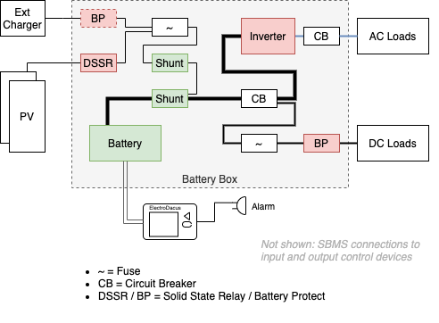
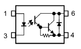
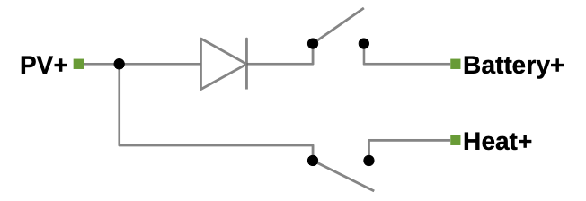

# ElectroDacus Solar Battery Management System SBMS0

<!-- TOC -->

- [ElectroDacus Solar Battery Management System SBMS0](#electrodacus-solar-battery-management-system-sbms0)
  - [Other Resources](#other-resources)
  - [The SBMS0 System](#the-sbms0-system)
  - [Components](#components)
    - [Controller Feature Summary](#controller-feature-summary)
    - [Controlling Power In](#controlling-power-in)
    - [Controlling Power Out](#controlling-power-out)
  - [Input (PV) Disconnect](#input-pv-disconnect)
    - [Input (PV) Diversion](#input-pv-diversion)
  - [Load Disconnect](#load-disconnect)
  - [Protective Devices: What and Where](#protective-devices-what-and-where)
- [SBMS0 Controller](#sbms0-controller)
  - [Connections](#connections)
  - [Cell Monitoring](#cell-monitoring)
    - [Cell Balancing](#cell-balancing)
  - [Input/Output Connections](#inputoutput-connections)
    - [Current Shunts](#current-shunts)
      - [Shunt Selection](#shunt-selection)
    - [EXT IO Modes / Types](#ext-io-modes--types)
      - [Type 0 unused](#type-0-unused)
      - [Type 1 HVD - High Voltage Disconnect](#type-1-hvd---high-voltage-disconnect)
      - [Type 2 LVD - Low Voltage Disconnect](#type-2-lvd---low-voltage-disconnect)
      - [Type 3 High SoC Alarm](#type-3-high-soc-alarm)
      - [Type 4 Low SoC Alarm](#type-4-low-soc-alarm)
      - [Type 5 Fault](#type-5-fault)
      - [Type 6 Dual PV Control](#type-6-dual-pv-control)
  - [Isolated Data Header](#isolated-data-header)
- [DSSR20 Solid State Relay](#dssr20-solid-state-relay)
  - [The Ideal Diode and Fusing](#the-ideal-diode-and-fusing)
  - [Non-Standard Configurations](#non-standard-configurations)
- [Using the SBMS0](#using-the-sbms0)
- [FAQ](#faq)
  - [Can I use the SBMS0 with disconnect devices other than the DSSR20?](#can-i-use-the-sbms0-with-disconnect-devices-other-than-the-dssr20)
  - [Can the SBMS0 survive a battery disconnection when PV is still connected?](#can-the-sbms0-survive-a-battery-disconnection-when-pv-is-still-connected)

<!-- /TOC -->

This is an unofficial guide to the ElectroDacus Solar Battery Management System SBMS0. This document exists as I found the official documentation for the SBMS0 to be less than clear. It does NOT replace or override the official documentation, and may be completely wrong on multiple accounts (PRs welcome).

The SBMS0 is a novel approach to managing solar-powered energy storage, produced by [ElectroDacus](https://electrodacus.com/) as an open-source hardware ([CC BY-SA 3.0](https://creativecommons.org/licenses/by-sa/3.0/)) project (as of mid 2020 the schematic and software source code are not yet published). Dacian Todea, the project's lead and primary (sole?) contributor, has been developing various iterations of a solar battery management system since at least 2011. Dacian's not in the business of producing SBMS systems at commercial scale ("A few words are more than sufficient. It is my pleasure to be able to share knowledge." ([ref](https://groups.google.com/g/electrodacus/c/1bQlZ8quSP0/m/oNHQLPWaAgAJ))), as of late 2020 a business named [3D Brothers](https://3d-brothers.com/) are working on an [SBMS-based design](https://www.youtube.com/watch?v=MFbR4KenTuA) for commercial production.

The SBMS0 is the fourth (?) major design iteration and departs from earlier designs, and most commercial BMS, in separating out the controller from the power switching. The primary novelty for the SBMS0 is in not using any form of DC-DC conversion between the solar photovoltaic (PV) panel(s) and the battery - the principle being that *a PV input suitably matched to suitable battery chemistry* (e.g. LiFePO4) does not actually *require* any complex DC-DC conversion. Conventional wisdom is that some form of DC-DC conversion, such as a Maximum Power Point Tracking (MPPT) solar controller, is required to maximise power transfer from the PV to battery and/or safely charge the battery (e.g. lead-acid batteries have very particular charging requirements to maximise service life).

However the SBMS0 approach recognises that, whilst valuable and even necessary for some sub-optimal combinations of PV and battery, for an appropriately designed *system* with modern battery chemistry a DC-DC converter (MPPT controller) has marginal benefit at not-insignificant cost over a simpler direct connection. These costs are mainly financial and reliability (both short and long term). If the funds that  would have been spent on an MPPT controller are put towards over-provisioning PV panels the result can be an equally or higher capacity system that is cheaper and simpler to install and operate and with a much longer service life. Even when over-provisioning is not practical (e.g. on a space-constrained installation such as a van), the marginal capacity "loss" from not using an MPPT is not generally a problem and still provides simplicity and durability benefits.

Further, the SBMS0 system design can direct any excess energy from the over-provisioned PV input to thermal storage (heating).

TODO: insert practical results

## Other Resources

See the ElectroDacus documentation for details, including schematics:

* [SBMS0](https://electrodacus.com/SBMS0/SBMS0.pdf)
* [DSSR20](https://electrodacus.com/DSSR20/DSSR20.pdf)

Online resources:

* [Electrodacus -Open Source- Solar Battery Management System: Introduction and Setup](https://www.youtube.com/watch?v=eCspxDLZR9U)
* [diysolarforum > Solar BMS thread (SBMS0 SBMS40 SBMS120 and so on)](https://diysolarforum.com/threads/the-solar-bms-thread-sbms0-sbms40-sbms120-and-so-on.4194/)

## The SBMS0 System

The SBMS0 system is a little different to some all-in-one Battery Management Systems (BMS) that incorporate the control and power connect/disconnect within the one unit. Separating out the control and power functions provides greater modularity and flexibility in design and installation, and greater durability (the components most likely to fail - the power switching - are more readily repaired or replaced when they're separate modules). The SBMS0 is the control unit, the Diode + Solid State Relay (DSSR20) is the nominal input power switching component (others such as a Victron BatteryProtect can be used).

The following diagram shows a basic PV power system, consisting of:

1. Charging sources (PV and external charger, e.g. DC-DC charger)
2. "Battery box" with various fusing, control and measurement functions
3. Loads (AC and DC)

The items in green are measured by the SBMS0 (battery cell voltages, load and charge currents), and those in red are controlled by the SBMS0. The remaining components within the battery box are protective devices.

## Components

### Controller Feature Summary

SBMS0 system features:

* durable: no complex power electronics; the DSSR20 is a simple on/off cutoff with no power capacitors
* input capacity: up to 600A @ 49V; practical PV limit: 60 x 72-cell panels ("30S2P"), approx. 24kW
* battery capacity: 8-32 V; LiFePO4: 3-8S
* long-term data logging: up to 1 year at 2 minute granularity
* very efficient: controller power consumption is less than 1W, switch power loss is less than 1.5W per module; passively cooled
* cell balancing up to 200mA
* no direct load disconnect - requires separate component(s) and/or devices with appropriate remote on/off control

### Controlling Power In

The SBMS0 controller unit, in conjunction with one or more distributed PV disconnect modules, such as the DSSR20, manages the solar input to ensure that the PV panels are disconnected when the battery is fully charged. It calculates a battery State of Charge (SoC) by measuring each individual cell voltage as well as current in and out of the battery via an external shunt. If an optional second shunt is used, it can also separately measure PV current input - this is useful mainly for measuring system performance and not required for battery management per se.

### Controlling Power Out

On the discharge side of things the SBMS0 can control external low voltage disconnect components such as an inverter remote control or load relay/SSR (e.g. Victron BatteryProtect).  **The SBMS0 cannot, alone, disconnect loads on a low-SoC state.**

## Input (PV) Disconnect

The power generated by a PV panel has an interesting characteristic in that current approaches zero as the voltage reaches maximum. If the panel were perfectly matched to the battery voltage and chemistry, it could simply be permanently directly connected to the battery as the panel wouldn't be able to go beyond the battery's safe operating voltage. In practice variations arising from temperature and irradiance mean that such a setup would not be capable of fully charging a battery except in exceptional "ideal" conditions. Practically, the PV panel should be such that it can deliver a suitable charge current even under non-ideal conditions, which means that in better conditions it *would* be capable of over-charging the battery.

Thus, in a practical direct-connection setup, some means of disconnecting the charging source (PV input or other) is necessary to prevent damaging overcharging. The SBMS0 is designed to work with one or more DSSR20 which are an inexpensive and reliable method of disconnecting PV or other inputs up to 20A (two large 72-cell panels).  The SBMS0 can handle up to 30 DSSR20 modules for a total of 600A (29kW at the maximum input voltage of 49V; for PV inputs the limit is 60 x 72-cell ~400W panels with two panels per DSSR20, approx. 24kW).

Alternatively to the DSSR20, any charging source with a suitable remote on/off can be used. For example, a DC-DC vehicle charger.

### Input (PV) Diversion

The DSSR20 is available in two versions: with and without diversion. The latter is slightly cheaper as it omits some components. The diverting version of the DSSR0 can switch two loads: the primary (battery) as above, and a second "diverted" load. The intention is that when excess PV power is available that excess power can be connected to the other load such as thermal storage.

> The companion [DMPPT450](http://electrodacus.com/DMPPT450/DMPPT450.pdf) project extends the diversion concept for larger-scale heating; the DMPPT450 sits in front of the SBMS0 in place of the DSSR20 switches and can selectively connect groups of panels and the battery and thermal sinks to optimise the energy transfer between them.

## Load Disconnect

On the load side of the system it's critical to prevent battery over-discharge. For some battery chemistries such as LiFePO4 an over-discharge event will lead to permanent loss of capacity. When the battery reaches a sufficiently low SoC it's important to disconnect all loads before damage occurs. For the SBMS0 this is accomplished via signalling other components to disconnect - for example, the remote on/off function of an inverter or load connection relay.

> Aside on inverter disconnects: highly-capacitive loads such as inverters are challenging to switch on safely, the large inrush currents that occur when they are first powered on can damage even the sturdiest of relays, SSRs have no hope. Few load switching or battery disconnect systems are rated to switch inverters. It's often recommended that inverters and their ilk be connected permanently to the battery (via a fuse or circuit breaker only), and a low-power remote on/off control used to switch them on and off.

## Protective Devices: What and Where

The SBMS0 requires the shunts to remain connected to the battery at all times to avoid inductive disconnection transients from damaging the SBMS0 inputs - i.e. protection devices must be installed "after" the shunts, *not* between the shunts and battery.

PV Input fusing is not technically required as the DSSR acts as a diode, no current can flow *from* the battery to the PV connection beyond the DSSR. A fault in the DSSR (e.g. MOSFET short circuit) could impact this diode behaviour, so it is prudent to incorporate a fuse. Fusing *is* required for an external charger that is either uncontrolled, or by something like a Victron BatteryProtect, so it makes sense to use the same fuse for both.

The main DC circuit breaker acts as both over current protection and main load disconnect. The AC circuit breaker may also incorporate a Residual Current Device (RCD).

# SBMS0 Controller

The SBMS0 undergoes periodic minor updates to the hardware, the following relates to the v02c version ca. early 2020. The version number is printed on the rear of the SBMS0 module.

## Connections

The SBMS0 has multiple sets of connections:

1. Cell Monitoring and Balancing (grey 12-way IDC ribbon cable on the rear of the module)
2. Input/Output (IO) connector for measuring current flow and temperature, and controlling load disconnects (10 pin wire "quick connect" on the right hand side of the module)
3. WiFi/USB - normally populated if you order the WiFi/USB version (2x8 pin header)
4. Isolated Data - an unpopulated header on the WiFi/USB board that presents isolated I2C, serial data and extra EXTIO5,6
   1. The SBMS0 is provided with a 2x5 pin IDC box header that may be soldered to the Isolated Data connection; it's not normally installed to keep the physical profile of the module to a minimum

## Cell Monitoring

Cell monitoring is performed by a dedicated 3-to-8 Cell Li-ion Battery Pack Monitor IC, [ISL94203](https://www.renesas.com/us/en/www/doc/datasheet/isl94203.pdf). The ISL94203 also handles cell balancing (see below).

The provided cell monitoring 12-way ribbon cable is 28AWG (0.07mm^2) and does not need to be separately fused; any significant over-current will fuse the wire without pyrotechnics. The ISL94203 can detect an open connection to a cell (TODO: unclear if this function is used by the SBMS0: evidently the ISL94203 configuration registers are displayed by the SBMS0 diagnostic: check register 4A).

The ISL94203 only reads its configuration on power-on - thus any parameter changes made on the SBMS0 will only take effect when the SBMS0 is power cycled by disconnecting and reconnecting the cell monitoring cable.

### Cell Balancing

Cell balancing is achieved via a 24 Ω resistor switched across each cell by a FET controlled by the ISL94203; nominal balancing current is therefore 3.6 V / 24 Ω = 150 mA. Cell balancing is only enabled when:

* all cell voltages exceed 3.2V, and
* cell voltage deviation exceeds 10 mV, and
* charging current exceeds 300 mA

These parameters are configurable in the ISL94203; refer the datasheet for details. (TODO: verify if exposed by the SBMS0 config.)

## Input/Output Connections

Put simply, the SBMS0 has two relatively protected voltage measuring inputs for the load and charging shunts and one resistance measuring input for a temperature sensor, and multiple digital outputs that act as low-current switches.

In more detail: all IO connectors are differential: they have separate positive and negative connections, as opposed to a single-ended IO with a common/shared ground. This is advantageous for better noise rejection and also ensures all connections are isolated including from each other (up to 76V for the analogue inputs). The ADC and PV inputs are directly connected to current-sense amplifier sense inputs; these are both bidirectional - can measure current flow in both directions. The PV shunt is normally expected to have current flowing from the PV to battery so the polarity of the PV inputs is "reversed" to reflect this usual current direction: thus PVp is connected to the "more positive" side even though technically it's connected to the negative sense input.

The optocoupled outputs are isolated Darlington transistor outputs and essentially behave as a switch that can sink up to a *maximum* of 150 mA (and 300V, ref. TLP187 datasheet) - under 50mA is recommended by ElectroDacus ([ref](https://groups.google.com/g/electrodacus/c/2OB3qrNVyYU/m/HE2ZlcKOBAAJ)). Polarity is significant - the negative 'n' side of the output must be at the lower potential, typically ground; be aware the optocoupler also has reverse biased diode across its output junctions so if the digital output is connected in reverse, it'll be "always on".

The outputs can be reconfigured to suit multiple functions, described in the next section. The default configuration is given in the following table:

| Pin Label | Function | Description | Technical Note |
| ---- | ---- | ---- | ---- |
| ADC | Analogue Input | Primary (battery) shunt | current sense input |
| PV | Analogue Input | Charge (PV) shunt (optional) | current sense input |
| XT | Analogue Input | Thermocouple input (optional) | 10k Ω input impedance |
| EXTIO3 | Digital output | Default: load on/off | optocoupled |
| EXTIO4 | Digital output | Default: charge on/off | optocoupled |
| EXTIO5 | Digital output | Default: unused | optocoupled |
| EXTIO6 | Digital output | Default: 'fault' | optocoupled |

EXTIO1 and EXTIO2 are skipped (used for isolated data I2C).

### Current Shunts

The SBMS0 is designed to use conventional current shunts for measuring current to/from the battery, and optionally from the charging source. If the charging (PV) shunt is installed, the SBMS0 is then able to distinguish charge and load currents separately which can then provide an accurate view of PV performance independently of loads. If the PV shunt is omitted the SBMS0 can still provide battery management and State of Charge (SoC) measurements.

#### Shunt Selection

Shunts must be selected to be able to carry the expected current however larger rated shunts will result a more coarse measurement resolution by the SBMS0, and thus a less accurate SoC calculation. Most shunts must be rated to at least 150% of the expected load, 200% for elevated temperatures - refer to the shunt manufacturer for detailed derating specifications.

The range of the SBMS0 main shunt ("ADC") input is +/- 90mV, with a resolution of 16 bits ~= +/- 2^15 (32,768) steps; or 90mV/2^15 = 2.75 uV per step. The PV shunt is single-ended (can measure positive values only) and has the full 65,536 step range (i.e. double the resolution). Note that any ADC has inherent inaccuracies due to electrical noise and offset errors, typically at least a few steps. The SBMS0 can compensate for offset errors via a calibration procedure (TODO verify). TODO: the STM32F3 has both "fast" 12-bit and "precise" 16-bit ADCs; unclear which is used, and whether the "16-bit resolution" is before or after filtering or over-sampling; shunt calibration procedure.

As an example of scale and resolution, for a system with a maximum continuous load current of around 150A, a load shunt must be rated to at least 225A (more, say 300A, if the system is in a warm environment). A 250A/75mV shunt will give a range of +/- 75mv/90mV * 2^15 = 25,869 steps; which equates to 250A/25,869 ~= 0.01 A/step, or a resolution of about 10mA. The SBMS0 could measure transient loads up to 300A before going over-range.

A similar calculation holds for the PV shunt; the PV shunt would generally be rated much lower than the load shunt.

### EXT IO Modes / Types

References

* <https://groups.google.com/g/electrodacus/c/gsGjTV3cbC0/m/JS0Mkci2AAAJ>
* <https://groups.google.com/g/electrodacus/c/2OB3qrNVyYU/m/HE2ZlcKOBAAJ>

Each of the four EXTIO outputs can be set to one of six different modes or "types".

> The SoC-based outputs (Type 3 and 4) should not be used for ensuring battery safety - a State of Charge measurement is not sufficiently accurate to reliably protect the battery under all conditions. For example, multiple partial charge-discharge cycles will cause SoC integration errors to accumulate and will result in an inaccurate SoC measurement.

#### Type 0 unused
* an EXTIO set to type 0 is effectively disabled

#### Type 1 HVD - High Voltage Disconnect

* charging control
* voltage sense: disconnects when battery reaches (TODO, adjustable?) xx V
* used to control any charger that can be DSSR20, an MPPT solar charger with remote ON/OFF, a grid charger or a battery to battery charger

#### Type 2 LVD - Low Voltage Disconnect

* load disconnect
* voltage sense: disconnects when battery reaches (TODO, adjustable?) xx V
* control remote on/off for load devices such as an inverter or Victron Battery Protect

#### Type 3 High SoC Alarm

* per Type 1, however based on State of Charge

#### Type 4 Low SoC Alarm

* per Type 2, however based on State of Charge
* may be useful to switch an "optional" load, for example disabling an air conditioning system when estimated SoC falls below 50%

#### Type 5 Fault

* secondary high or low voltage limits (under voltage or over voltage lock) reached
* can be used as backup in the event a controlled charger or load fails to respond
* requires a remote triggered circuit breaker or similar device

#### Type 6 Dual PV Control
* switch an optional additional charging source
* type 1 (primary) and type 6 (secondary) outputs are controlled together such that the total charge current from both sources is maximised but always lower than the configured battery limit (Imax)
* the two charging sources (for example, two PV arrays) are separately controlled: one via an EXTIO set as the standard type 1 output, the second EXTIO with this type 6 output
* the type 6 charge source is assumed to be around twice the capacity as that of the type 1 charge source; e.g. a 6 panel PV array as type 1 and 12 panel PV array as type 6
  * in other words, the secondary source is assumed to contribute twice the charge current than the primary source
* the control is stateful: the SBMS0 will only proceed to Level 3 (both sources) from Level 2 (secondary source only), similarly to Level 1 from Level 2
  * the "going down" threshold is set at 120% of Imax, i.e. charge level is reduced when charge current exceeds 120% Imax
  * the type 1 (primary) source is presumed to be matched to the battery and not able to exceed the battery charge current limit

|Level|Type 1 output|Type 6 output|SBMS0 Display|
|--|--|--|--|
|1|enabled|disabled|L1|
|2|disabled|enabled|L2|
|3|enabled|enabled|L3|

## Isolated Data Header

This "connector" requires soldering the provided IDC box header, or individual wires to the SBMS0. This connector provides galvanically isolated USB, 3.3V UART, I2C and EXTIO5 and EXTIO6. (On later revisions of the SBMS0, EXTIO5 and EXTIO6 are moved to the main IO connector)

TODO: Also on the board are two non-isolated? ADC inputs; 0-60V as referenced to Battery negative - unclear where the connections are for these inputs, appear to be inaccessible.

# DSSR20 Solid State Relay

The DSSR20 is a low-cost solid state switch with one or two twists. The first twist is the presence of an "ideal" (low-loss) diode in the PV-Battery path: this is advantageous in terms of mitigating certain types of failures that can occur on the PV side such as cabling shorts. The second twist is that it is available in a version that adds facility to switch a secondary resistive load - very useful for "heating diversion" as described above. The PV Disconnect functional diagram is as follows:

The Heat diversion path is not protected by an ideal diode, and is not designed to connect to an "active load" - one that can source current back to the PV. i.e. do not connect a power source such as a battery to this connection; passive loads only. Further, the load is not rated for reactive (inductive or capacitive) loads, so no motors or inverters. The Heat diversion control input is separate to the Battery control input; in the intended use case they would be logically inverted. i.e. when Battery is on, Heat is off and vice-versa. The DEXT16 module implements this logic given a single EXTIO output from the SBMS0. The DEXT16 also provides screw terminals and can make for a tidier installation when multiple DSSR20s are used.

The DSSR20 is powered from the PV input with a voltage monitoring reset IC that ensures it only operates when sufficient voltage is available. The MOSFET switches are off / open when the DSSR20 is not powered.

The DSSR20 is protected against reverse PV polarity, both the DSSR20 itself and the Battery and Heat outputs.

Power dissipation should be less than 2W under all operating conditions, and no heatsinking or forced cooling is required.

## The Ideal Diode and Fusing

When used as intended, no fuses are required between the PV panel(s), DSSR20(s) and battery. Eliminating fuses is a benefit in terms of cost and reliability.

The diode in the PV-to-Battery path is necessary to protect the DSSR20 in the event of a short circuit on the PV side. With only a battery fuse and no diode, a PV-side fault would see very high currents delivered from the battery until the battery-side fuse blew - no fuse can react quickly enough to prevent damage to the MOSFET switch. The ideal diode blocks any such fault currents and unlike a standard diode does so with very low power loss.

> Note the diode does nothing to protect the wiring between the battery and DSSR20: if there is any chance of a fault between the battery and DSSR0 - for example, if they are not located in the same protected enclosure - then a fuse must be installed near the battery to protect the wiring between the battery and DSSR20.

The DSSR20 is designed to handle up to two commonly available panels - typically around 10 A each, with a maximum of 20 A via the Battery or Heat outputs. With only one panel no PV-side fuse is required as the panel cannot possibly exceed its rated limits (it cannot deliver more than short-circuit current, Isc). With two panels in parallel it's still likely that no fuses are required, however it would be safest to check the manufacturer's ratings to be certain (alas, usually not specified). More than two panels in parallel creates more complex fusing requirements and is not recommended; each DSSR20 is intended for one or two panels to keep things simple.

## Non-Standard Configurations

The DSSR20 can handle 20A via the Battery output and 10A (?TBC) via the Heat output. Multiple DSSR20's can be placed in parallel to increase current capacity (internally, the PV to Battery+ path is two pairs of MOSFETs in parallel controlled by one IC, a parallel DSSR20 essentially adds another two pair in parallel - though with the distinction that a loose wire could cause the control signals to not be in sync and thus give rise to an overload of one of the DSSRs). The practical limit - before imbalances due to wiring resistances, etc become a problem - would be two DSSR20's. If for your use case you need to carry more than 20A, it may be more economical to use a Victron BatteryProtect instead of two DSSR20's - though note the BatteryProtect does *not* incorporate an ideal diode, so appropriate fusing is essential and even then any shorts on the PV side will likely toast the BatteryProtect as it cannot handle reverse currents.

Fusing on the PV side may still be required depending on the panel topology and characteristics, for example if two panels are used and they are not rated to handle the maximum combined current, a fuse on each panel should be used at the panel combiner junction.

# Using the SBMS0

TODO

# FAQ

## Can I use the SBMS0 with disconnect devices other than the DSSR20?

Yes - any device that can disconnect current in response to an SBMS0 EXTIO output can be used. e.g. a solar controller (if you insist on using MPPT, you can!), mains or DC-DC charger, or some other solid state or electromechanical relay (for a electromechanical relay, ensure a [flyback diode](https://www.google.com/search?q=electromechanical+relay+flyback+diode) is installed).

## Can the SBMS0 survive a battery disconnection when PV is still connected?

Yes. Some solar controllers that directly control a PV source can fail when the battery is disconnected with the PV still connected. The Electrodacus SBMS40/60/100/120 models, incorporating the switching electronics in the control unit, are susceptible to such a failure mode - those units must first have both PV and load removed before they can be disconnected from the battery.

The SBMS0 is designed such that it is safe to disconnect the cell monitor cable at any time (doing so will also safely turn off the controlled DSSRs and loads). However it is *not* safe to disconnect the battery from the SBMS0 shunt when any current is flowing (charge or discharge). If the battery is disconnected under charge or load a voltage spike will occur due to inductance in cabling and loads. This spike *can* damage the SBMS0. As such fuses and circuit breakers should be connected "downstream" of the SBMS0's shunt.
